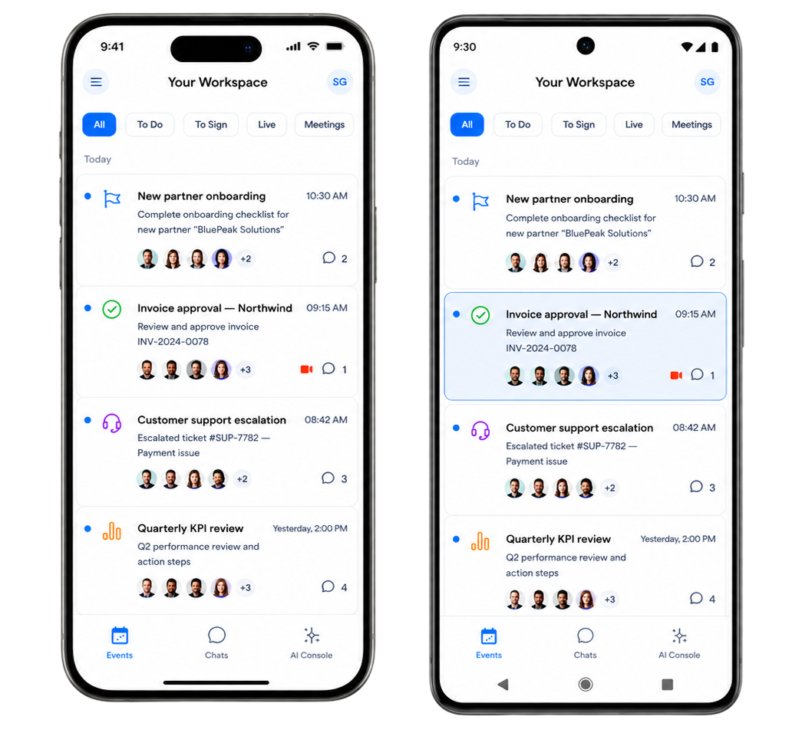

  

<h1 align="center">Simulator.Company — desktop releases</h1>

  

Official public releases of the **Simulator.Company desktop application** by
[Corezoid Inc.](https://corezoid.com)

> **This repository does not contain source code.** The application is
> proprietary. What lives here is the released installers, their checksums and
> torrents, the release notes, the machine-readable release manifest, and the
> licence notices for bundled third-party components.

<!-- Not a plain /releases/latest badge: that endpoint now resolves to Simulator
     Desktop's release, not this application's — Simulator Desktop needs it for a
     stable, unversioned download link (see "Two applications, two tag namespaces"
     below), and GitHub only offers that mechanism to whichever release carries the
     flag. `filter=v*` keeps this badge honest by reading only this application's own
     tag namespace, regardless of which release GitHub calls "latest" repo-wide. -->
**[Downloads →](#downloads)**

---

## Downloads

Every release carries a `SHA256SUMS` asset with the SHA-256 of every file —
see [Verifying a download](SECURITY.md#verifying-a-download). Torrent links
carry a [webseed](https://www.bittorrent.org/beps/bep_0019.html), so they
download at full CDN speed even with no other peers online.

<!-- desktop-downloads:start — regenerated by Simulator Desktop's release script from
     what the release actually holds. Platform order macOS → Windows → Linux, with the
     OS emoji in every heading: that is part of the block's content, not decoration.
     The script fails rather than guessing where a table belongs if these markers are
     gone, so keep them even while the block is empty. -->

  

### 🍎 macOS — v0.12.91

| Processor | Disk image |
|---|---|
| **Intel** | [Download](https://github.com/corezoid/simulator-desktop-releases/releases/download/desktop-v0.12.91/SimulatorDesktop-mac-x64.dmg) · [torrent](https://github.com/corezoid/simulator-desktop-releases/releases/download/desktop-v0.12.91/SimulatorDesktop-mac-x64.dmg.torrent) |
| **Apple Silicon** | [Download](https://github.com/corezoid/simulator-desktop-releases/releases/download/desktop-v0.12.91/SimulatorDesktop-mac-arm64.dmg) · [torrent](https://github.com/corezoid/simulator-desktop-releases/releases/download/desktop-v0.12.91/SimulatorDesktop-mac-arm64.dmg.torrent) |

### 🪟 Windows — v0.12.91

| Architecture | Installer |
|---|---|
| **x64** | [Download](https://github.com/corezoid/simulator-desktop-releases/releases/download/desktop-v0.12.91/SimulatorDesktop-Setup-win-x64.exe) · [torrent](https://github.com/corezoid/simulator-desktop-releases/releases/download/desktop-v0.12.91/SimulatorDesktop-Setup-win-x64.exe.torrent) |
| **arm64** | [Download](https://github.com/corezoid/simulator-desktop-releases/releases/download/desktop-v0.12.91/SimulatorDesktop-Setup-win-arm64.exe) · [torrent](https://github.com/corezoid/simulator-desktop-releases/releases/download/desktop-v0.12.91/SimulatorDesktop-Setup-win-arm64.exe.torrent) |

### 🐧 Linux — v0.12.91

| Architecture | deb | rpm | AppImage |
|---|---|---|---|
| **x64** | [Download](https://github.com/corezoid/simulator-desktop-releases/releases/download/desktop-v0.12.91/SimulatorDesktop-linux-amd64.deb) · [torrent](https://github.com/corezoid/simulator-desktop-releases/releases/download/desktop-v0.12.91/SimulatorDesktop-linux-amd64.deb.torrent) | [Download](https://github.com/corezoid/simulator-desktop-releases/releases/download/desktop-v0.12.91/SimulatorDesktop-linux-x86_64.rpm) · [torrent](https://github.com/corezoid/simulator-desktop-releases/releases/download/desktop-v0.12.91/SimulatorDesktop-linux-x86_64.rpm.torrent) | [Download](https://github.com/corezoid/simulator-desktop-releases/releases/download/desktop-v0.12.91/SimulatorDesktop-linux-x86_64.AppImage) · [torrent](https://github.com/corezoid/simulator-desktop-releases/releases/download/desktop-v0.12.91/SimulatorDesktop-linux-x86_64.AppImage.torrent) |
| **arm64** | [Download](https://github.com/corezoid/simulator-desktop-releases/releases/download/desktop-v0.12.91/SimulatorDesktop-linux-arm64.deb) · [torrent](https://github.com/corezoid/simulator-desktop-releases/releases/download/desktop-v0.12.91/SimulatorDesktop-linux-arm64.deb.torrent) | [Download](https://github.com/corezoid/simulator-desktop-releases/releases/download/desktop-v0.12.91/SimulatorDesktop-linux-aarch64.rpm) · [torrent](https://github.com/corezoid/simulator-desktop-releases/releases/download/desktop-v0.12.91/SimulatorDesktop-linux-aarch64.rpm.torrent) | [Download](https://github.com/corezoid/simulator-desktop-releases/releases/download/desktop-v0.12.91/SimulatorDesktop-linux-arm64.AppImage) · [torrent](https://github.com/corezoid/simulator-desktop-releases/releases/download/desktop-v0.12.91/SimulatorDesktop-linux-arm64.AppImage.torrent) |

Release notes and every checksum: [desktop-v0.12.91](https://github.com/corezoid/simulator-desktop-releases/releases/tag/desktop-v0.12.91).
<!-- desktop-downloads:end -->

The current application's builds are still published here under their own `v*`
tags — see [releases](https://github.com/corezoid/simulator-desktop-releases/releases)
and [`desktop-releases.json`](desktop-releases.json), which stays the
machine-readable per-platform answer for it. Installed copies keep updating from
[app.simulator.company](https://app.simulator.company) as before; GitHub is a
mirrored distribution point and neither depends on the other.

### 📱 Mobile applications

<!-- Outside every generated block on purpose: the release script owns
     desktop-downloads and nothing else, so this section is plain README text and
     stays put. -->

  

Simulator.Company is also available for phones and tablets:

| | |
|---|---|
| **iOS** | [App Store — Simulator.Company](https://apps.apple.com/app/simulator-company/id6754986862) |
| **Android** | [Google Play — Simulator.Company](https://play.google.com/store/apps/details?id=company.simulator.app) |

Mobile builds are distributed only through the stores; they are not attached to
releases here.

---

## What is in this repository

| | |
|---|---|
| **Installers** | Attached to each [release](https://github.com/corezoid/simulator-desktop-releases/releases) as assets |
| **`SHA256SUMS`** | One per release: the SHA-256 of every asset in that release |
| **`SHA256SUMS.sigstore.json`** | Sigstore signature of `SHA256SUMS`; verify against [`cosign.pub`](cosign.pub) |
| **Torrents** | `.torrent` assets next to the installers they cover, with a webseed |
| **`desktop-releases.json`** | Machine-readable manifest — see [docs/RELEASE_MANIFEST.md](docs/RELEASE_MANIFEST.md) |
| **`simulator-desktop.json`** | The same, for the next-generation **Simulator Desktop** releases |
| **Release notes** | On every release, including anything that affects installing or updating |
| **[`CHANGELOG.md`](CHANGELOG.md)** | The same history in one file |
| **[`THIRD_PARTY_NOTICES.md`](THIRD_PARTY_NOTICES.md)** | Licences and source offers for bundled third-party components |

## What is **not** here

- The source code of the application.
- Issue tracking. **Issues are disabled** — see [SUPPORT.md](SUPPORT.md) for
  where to ask questions and report problems.
- Pull requests. Nothing here is built from contributions.

---

## Versions and tags

Releases are tagged `v<major>.<minor>.<patch>` and follow semantic versioning.
A release contains the platforms built for that version; platforms released on
their own cadence (macOS today) appear under their own version tag, and
[`desktop-releases.json`](desktop-releases.json) always names the current
version **per platform** — that file, not the tag list, is the machine-readable
answer to "what should this machine be running".

Pre-releases carry a `-beta.N` suffix and the GitHub *pre-release* mark. They
are published for testing and are not offered to anyone who did not ask for
them.

### Two applications, two tag namespaces

**Simulator Desktop** — the new application, and what [Downloads](#downloads)
offers — is tagged `desktop-v<version>` and published as a full release: the builds
here are the recommended ones, and `simulator-desktop.json` says `channel: stable`.
Its versions are named per platform in
[`simulator-desktop.json`](simulator-desktop.json).

The current **Simulator.Company** application keeps `v<version>` tags and
[`desktop-releases.json`](desktop-releases.json), untouched by any of the above. Two
files rather than one so that nothing reading the current application's manifest is
ever offered a build of the next one it did not ask for.

**Simulator Desktop's releases carry the repository-wide *latest release* mark**
(`make_latest: true`) — the opposite of what used to be true here. Third-party integrations need one download link that survives a version bump,
and GitHub only offers that through `/releases/latest/download/<name>`, which
resolves to whichever release carries this flag; there is no way to grant that link
without also granting the mark. Simulator.Company's own "latest release" badge above
and its [INSTALL.md](INSTALL.md) link are therefore scoped to the `v*` tag namespace
explicitly, rather than relying on the repository-wide mark.

Numbering continues across both: the current application's last build is 0.12.7, so
Simulator Desktop starts at 0.12.8. One number never means two different builds.

---

## Updating

The installed application checks
[app.simulator.company](https://app.simulator.company) and updates itself; you
do not need to watch this repository. Installing a newer version over an
existing one by hand also works and keeps your settings and session.

---

## Licences

The application is proprietary software. It bundles third-party components,
some under copyleft licences. Notices, licence texts and the written offer for
corresponding source code are in
[THIRD_PARTY_NOTICES.md](THIRD_PARTY_NOTICES.md).

## Security

How to verify that a download is genuinely ours, and how to report a
vulnerability: [SECURITY.md](SECURITY.md).
